## Reading
How to answer questions in a helpful way
  - Don't respond if it wont be helpful (deragatory comments etc)
  - Look at other people's answers and build on it
  
Free Culture Chapter 3
  What I learned from reading that chapter is to make sure whatever you are working on will not piss anyone off.
  If I ever want to create something that uses the internet or a network, I should make sure to read up on what is legal
  and what is not. It seems that the RIAA is an extremely petty and greedy corporation that would take away a poor college
  students saving to make some money. So, if I ever work with music, I will have to make sure I read all the laws involving
  using music files or they could come after me.
  
## Linux Stuff
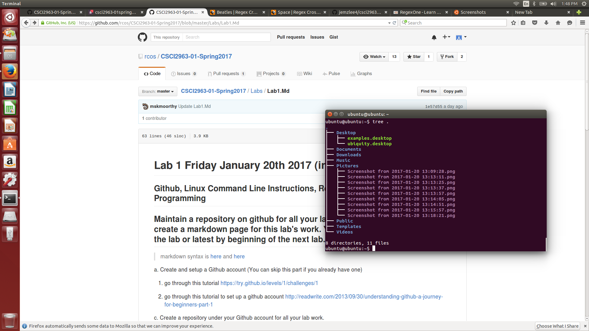

## Regex Stuff
### Part 1
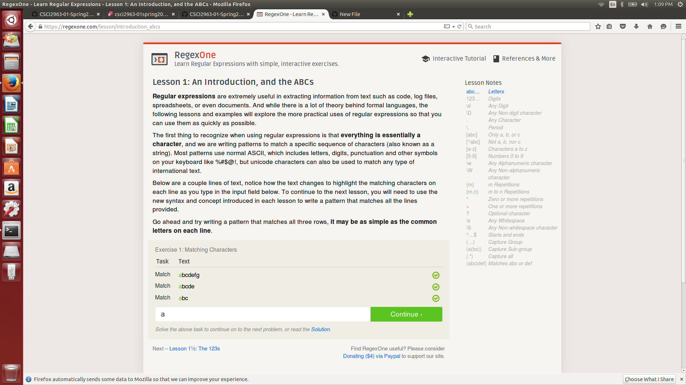
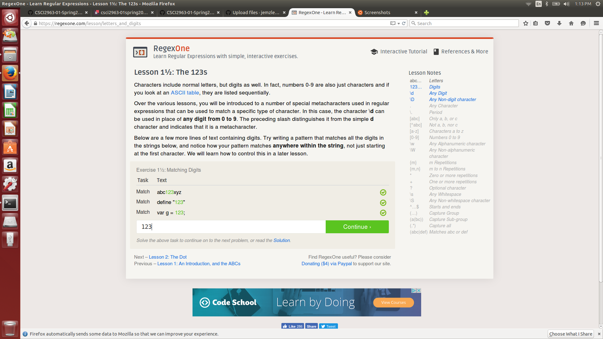
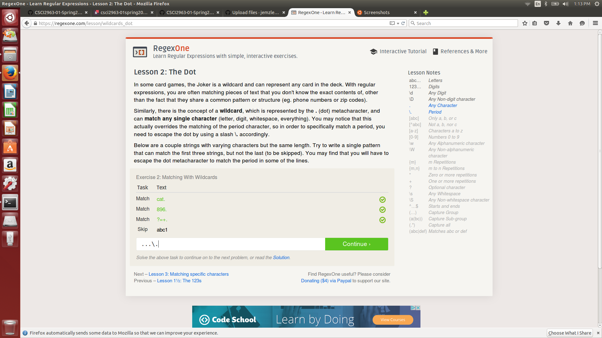
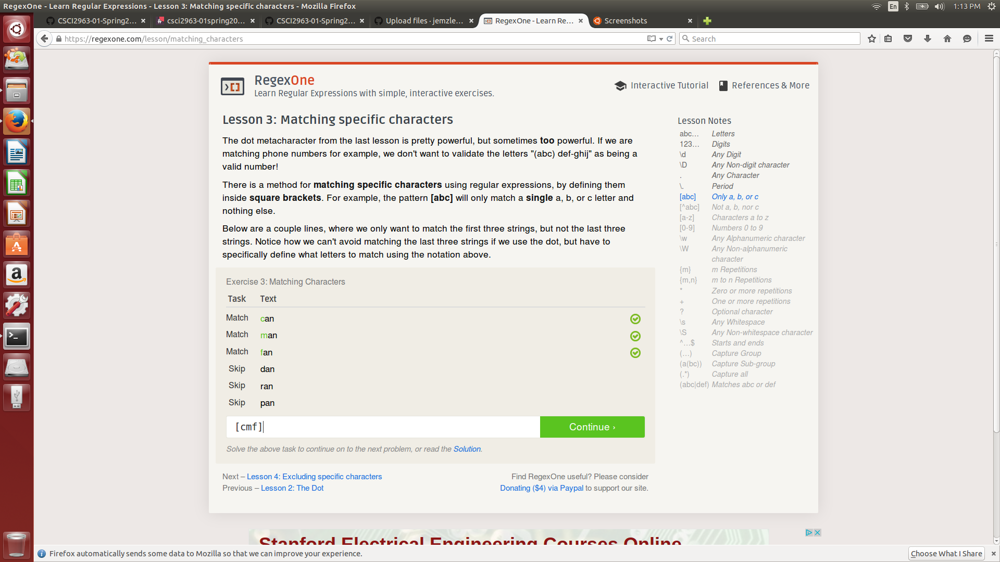

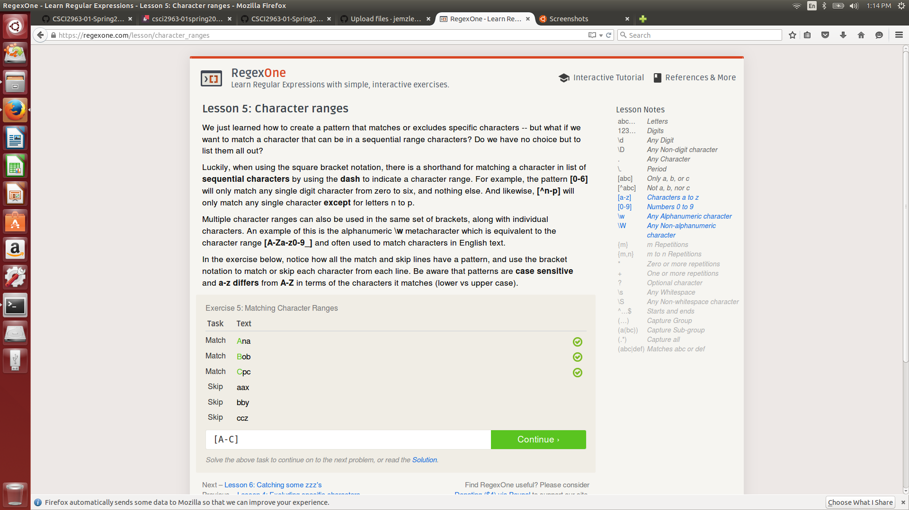
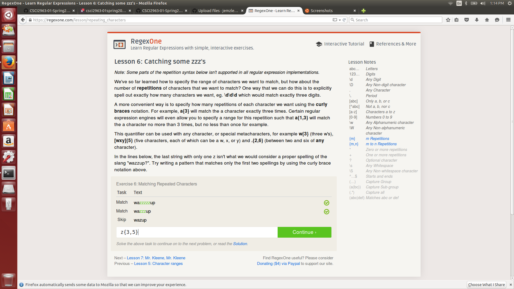

### Part 2
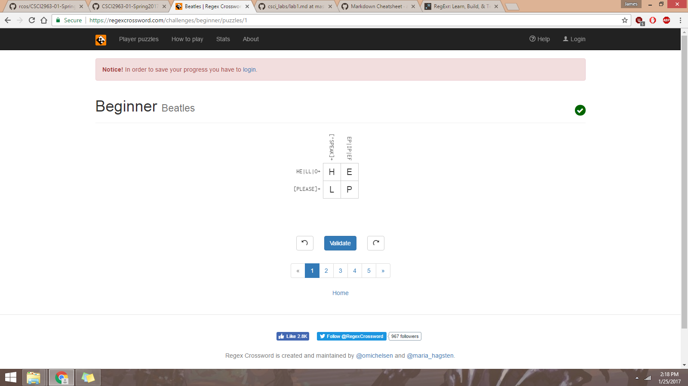
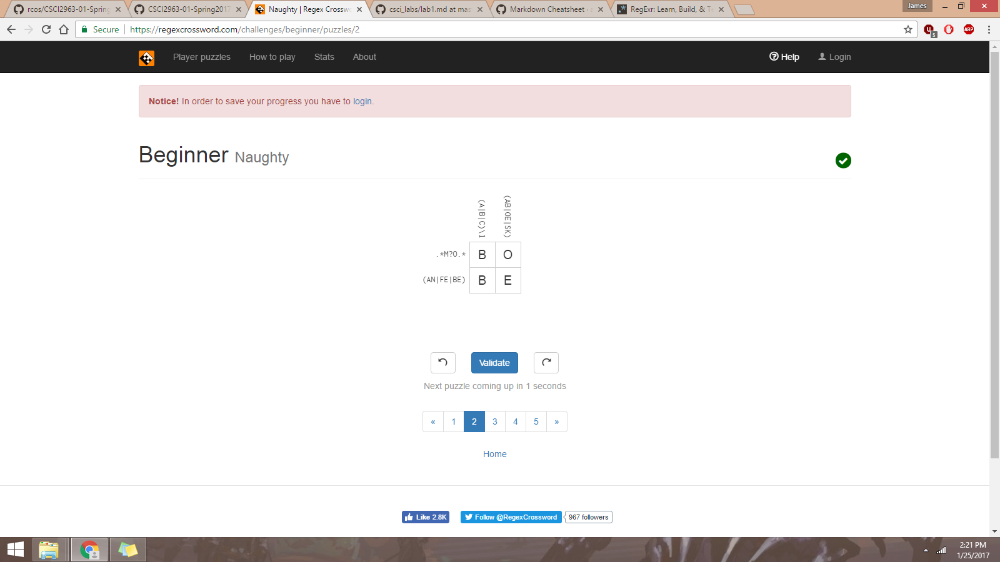
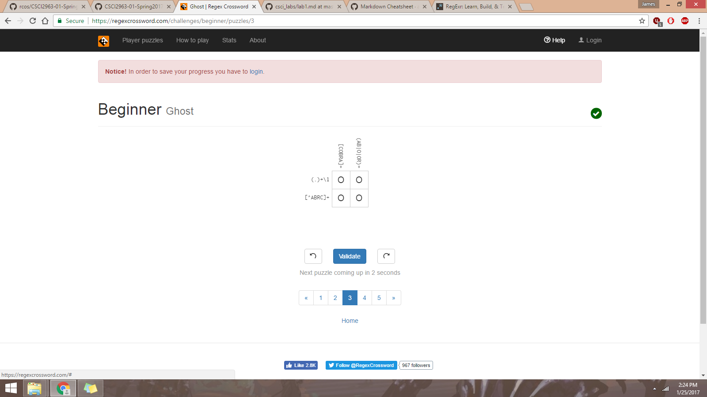
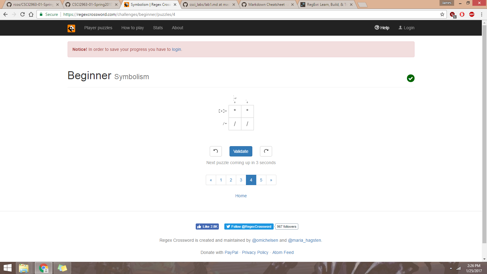
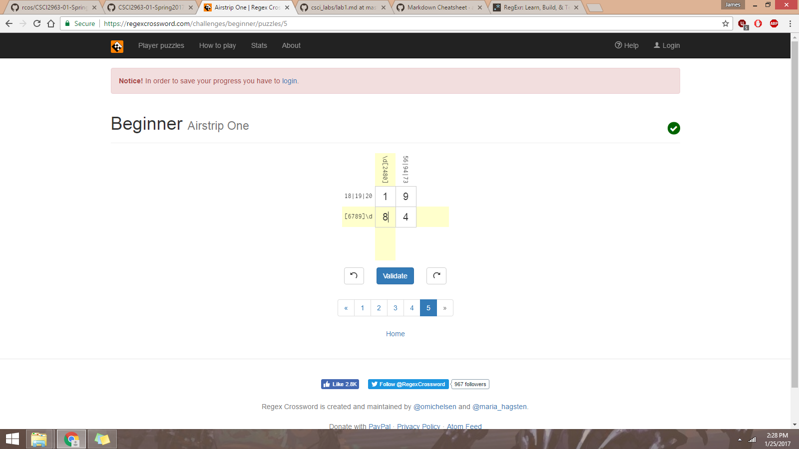
